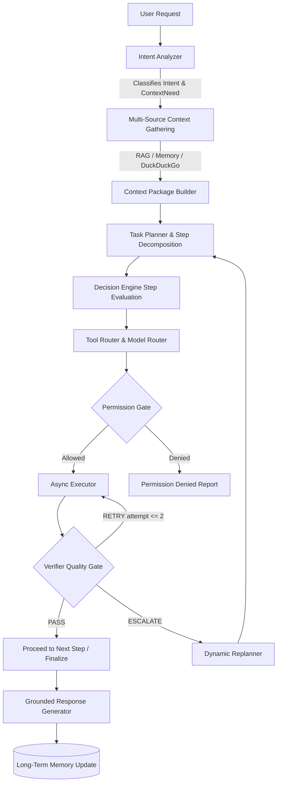

# KORA — V7: AGENT REASONING & DECISION ENGINE SPECIFICATION

**Status**: Implemented & Verified  
**Version**: 1.0  
**Layer**: Cognitive Core (V7)

---

## 1. Overview & Core Loop

The **Agent Reasoning & Decision Engine** is the central cognitive loop orchestrating user intent analysis, multi-source context retrieval decisions, hierarchical task planning, model & tool selection, permission gate enforcement, asynchronous execution, output verification, dynamic failure replanning, grounded final response generation, and post-execution memory persistence.

---

## 2. Subsystem Components

### A. Intent Analyzer & Context Decision (`core.intent_analyzer`)
Classifies requests into 7 fine-grained `IntentType` categories and 8 `ContextNeed` states:
- **Intents**: `GENERAL_CONVERSATION`, `KNOWLEDGE_RAG`, `MEMORY`, `WEB_RESEARCH`, `TOOL_ACTION`, `MULTI_STEP_TASK`, `MIXED_REQUEST`.
- **Context Needs**: `NONE` (conversational bypass), `RAG`, `MEMORY`, `WEB` (DuckDuckGo), `RAG_AND_MEMORY`, `RAG_AND_WEB`, `MEMORY_AND_WEB`, `ALL`.
- **Guarantee**: Trivial chat or math queries never trigger wasteful retrieval operations.

### B. Dynamic Model Router (`core.model_router`, `models.registry`)
- Capabilities are mapped via `ModelRegistry` loaded from `models/registry.yaml`:
  - `chat`, `reason`, `code` $\rightarrow$ Qwen family
  - `vision`, `audio` $\rightarrow$ Gemma family
- **Guarantee**: Zero hardcoded model IDs exist in Python source files.

### C. Task Planner & Dynamic Replanner (`core.planner`)
- Formulates ordered `PlanStep` items containing:
  - `goal`: Concrete sub-goal description.
  - `required_context`: `[SourceType.RAG, SourceType.WEB, ...]`
  - `required_tool`: Target tool identifier.
  - `dependencies`: List of predecessor step indices.
  - `expected_result`: Verifiable success criteria.
  - `verification_method`: Assertion logic.
- **Dynamic Replanning**: Upon step failure or escalation, `replan()` inspects the failure cause and synthesizes a recovery plan.

### D. Tool Router & Permission Gate (`core.tool_router`, `permissions.gate`)
- Resolves `ActionType` into concrete subsystem dispatchers:
  - `RAG_QUERY` $\rightarrow$ `RAGRetriever`
  - `WEB_RESEARCH` $\rightarrow$ `WebResearchEngine` (DuckDuckGo only)
  - `MEMORY_QUERY` $\rightarrow$ `MemoryManager`
  - `TOOL_CALL` $\rightarrow$ `ToolRegistry` + `PermissionGate`
  - `MODEL_GENERATE` $\rightarrow$ `Executor` / Model streaming
- **Permission Enforcement**: Never executes restricted tools without active session permission grants.

### E. Execution & Result Verifier (`core.executor`, `core.verifier`)
- Asynchronously executes actions and emits WebSocket events (`TOOL_CALL_NOTIFY`, `TOOL_RESULT_NOTIFY`, `CHAT_CHUNK`).
- Verifier inspects outputs and returns:
  - `PASS`: Output meets expected criteria.
  - `RETRY`: Transient error or empty output (up to 2 retries).
  - `ESCALATE`: Unrecoverable error triggering replanning.

### F. Decision Engine Loop (`core.decision_engine`)
- Integrates all components into an end-to-end execution pipeline.
- Formats final response with verified context citations, action status, and any limitation notices.
- Persists meaningful turn outcomes to long-term memory.
