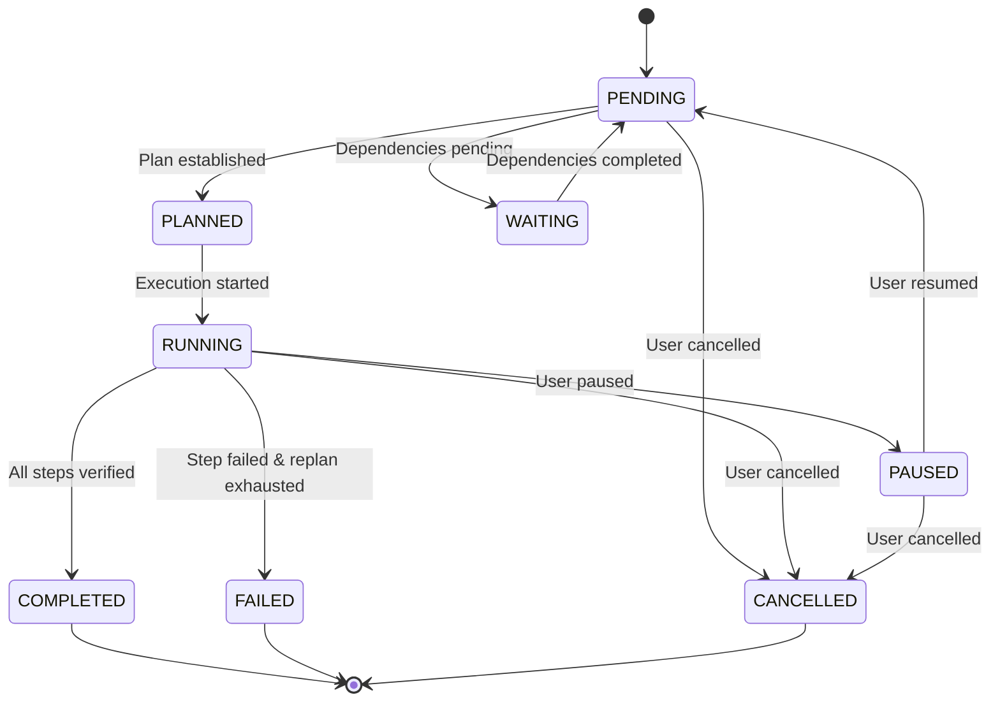

# Kora Autonomous Task & Automation Engine (V9) — Architecture & Guide

## 1. Overview

Kora V9 delivers an enterprise-grade **Autonomous Task & Automation Engine** built on top of Kora's cognitive architecture (RAG V1–V4, Long-term Memory V5, DuckDuckGo Web Research V6, Agent Reasoning V7, and Tool System V8).

```
User Request / Trigger / Event / Schedule
                   │
                   ▼
           ┌──────────────┐
           │  TaskManager │ ◄───► DB Models & In-Memory/Redis State
           └──────┬───────┘
                  │
          ┌───────┴────────┐
          ▼                ▼
   ┌──────────────┐ ┌────────────────────────────────────────┐
   │  Automation  │ │ AutonomousTaskExecutor                 │
   │    Engine    │ │  1. Plan (V7 Planner)                  │
   │ (APScheduler │ │  2. Resolve Context (V4/V5/V6 Resolver)│
   │ + EventBus)  │ │  3. Route & Gate Tools (V8 Tools)      │
   │              │ │  4. Verify Output (V7 Verifier)        │
   │              │ │  5. Retry / Replan on failure          │
   │              │ │  6. Record Learnings (V5 Memory)       │
   └──────┬───────┘ └────────────────────────────────────────┘
          │                        ▲
          └────────────────────────┘
```

---

## 2. Deterministic Task Lifecycle & States

Every task transitions through 8 deterministic states:



---

## 3. Automation Engine & Trigger Support

The [`AutomationEngine`](file:///home/rev/My_Personal_Space/Projects/Unfinished/Myagent/apps/agent/tasks/automation.py) manages scheduling and event listeners:

- **Date / Time Triggers** (`TriggerType.DATE`): One-time execution at a specific UTC timestamp.
- **Interval Triggers** (`TriggerType.INTERVAL`): Recurring periodic runs (e.g., every 300 seconds).
- **Cron Triggers** (`TriggerType.CRON`): Standard 5-field cron expressions or dictionary definitions.
- **Event-Driven Triggers** (`TriggerType.EVENT`): Asynchronous dispatching over internal [`EventBus`](file:///home/rev/My_Personal_Space/Projects/Unfinished/Myagent/apps/agent/tasks/automation.py).
- **Task Completion Cascades** (`TriggerType.TASK_COMPLETION`): Parent task completion automatically triggers dependent downstream tasks.
- **Conditional Evaluation** (`condition_expr`): Operator dictionaries (e.g. `{"key": "cpu_pct", "op": ">", "value": 85}`) evaluated before execution.

---

## 4. Autonomous Execution Loop

The [`AutonomousTaskExecutor`](file:///home/rev/My_Personal_Space/Projects/Unfinished/Myagent/apps/agent/tasks/executor.py) executes tasks end-to-end:

1. **Context Retrieval**: Queries [`ContextResolver`](file:///home/rev/My_Personal_Space/Projects/Unfinished/Myagent/apps/agent/core/context_resolver.py) to pull strictly necessary knowledge from Project RAG, Long-Term Memory, and DuckDuckGo Web Research.
2. **Task Planning**: Uses [`Planner`](file:///home/rev/My_Personal_Space/Projects/Unfinished/Myagent/apps/agent/core/planner.py) to decompose goals into ordered, dependency-aware [`PlanStep`](file:///home/rev/My_Personal_Space/Projects/Unfinished/Myagent/apps/agent/core/types.py) items.
3. **Permission Gating**: Validates every tool action through [`PermissionGate`](file:///home/rev/My_Personal_Space/Projects/Unfinished/Myagent/apps/agent/permissions/gate.py).
4. **Tool Execution**: Invokes tools via [`ToolRegistry`](file:///home/rev/My_Personal_Space/Projects/Unfinished/Myagent/apps/agent/tools/registry.py).
5. **Output Verification**: Verifies results with [`Verifier`](file:///home/rev/My_Personal_Space/Projects/Unfinished/Myagent/apps/agent/core/verifier.py).
6. **Exponential Backoff & Replanning**:
   - Transient failures trigger retries with exponential backoff (`0.05s * 2^attempt`).
   - Unrecoverable step failures invoke the planner to generate recovery sub-plans spliced dynamically into the execution queue.
7. **Memory Persistence**: Automatically commits task outcome summaries into Long-Term Memory via [`MemoryManager`](file:///home/rev/My_Personal_Space/Projects/Unfinished/Myagent/apps/agent/memory/manager.py).

---

## 5. Safety, Persistence & Secret Scrubbing

- **Duplicate Prevention**: Rejects duplicate active tasks (`DuplicateTaskError`) with identical goals unless explicitly allowed.
- **Crash & Restart Recovery**: [`TaskManager.recover_on_startup()`](file:///home/rev/My_Personal_Space/Projects/Unfinished/Myagent/apps/agent/tasks/manager.py) reconciles tasks abandoned in `RUNNING` or `PLANNED` states upon system restart.
- **Secret Masking**: All metadata, tool parameters, and step outputs pass through [`sanitize_audit_payload()`](file:///home/rev/My_Personal_Space/Projects/Unfinished/Myagent/apps/agent/tools/audit.py) to redact passwords, bearer tokens, and API keys (`****** [REDACTED SECRET]`).
