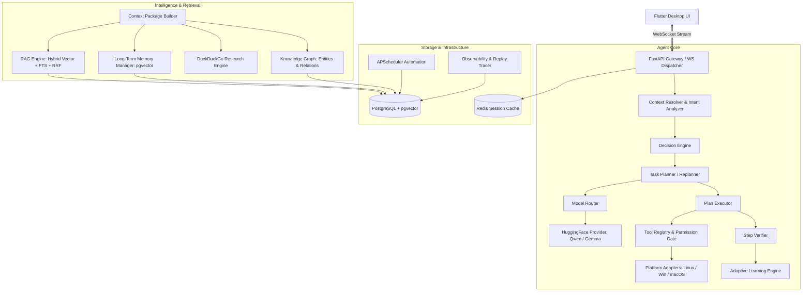

# Kora Foundation Audit & Implementation Status (M1)

**Audit Date**: September 2026  
**Repository**: Kora Assistant  
**Target Architecture Stack**: Flutter + Dart | Python + FastAPI | PostgreSQL + pgvector | Redis | WebSocket | DuckDuckGo | Hugging Face (Qwen + Gemma) | Playwright | APScheduler  
**Test Suite Status**: 197 / 197 Passing Unit & Integration Tests (4.33s)

---

## 1. Executive Summary & Current Architecture

Kora is an autonomous local-first AI assistant built with a Flutter desktop client and a Python FastAPI agent core. Over development phases V1 through V14, core intelligence, retrieval, tool execution, knowledge graphs, adaptive learning, and observability systems were architected and implemented.

### Current System Architecture Diagram



---

## 2. Component Status Matrix

| Component | Status | Location / Reference | Notes |
| :--- | :--- | :--- | :--- |
| **Flutter Project Structure** | `PARTIALLY_IMPLEMENTED` | `apps/desktop/` | Core views (Chat, Projects, Observability), WebSocket client, state management built; missing automated test suite and audio widgets. |
| **FastAPI Structure** | `IMPLEMENTED` | `apps/agent/main.py`, `apps/agent/api/` | Lifespan manager, clean HTTP routes (`api/http.py`), WebSocket bidirectional streaming handler (`api/ws.py`). |
| **Agent Core** | `IMPLEMENTED` | `apps/agent/core/` | `DecisionEngine`, `ContextResolver`, `ContextPackageBuilder`, `ContextManager`, `SessionManager`. |
| **Planner / Executor / Verifier / Replanner** | `IMPLEMENTED` | `apps/agent/core/` | Step planning, tool execution loop, verification logic, dynamic replanning, execution analysis. |
| **Model Registry / Router / Gateway** | `IMPLEMENTED` | `apps/agent/models/` | Capability-based routing via `registry.yaml`, `HuggingFaceProvider` streaming, zero hardcoded model strings. |
| **RAG System (V1–V4)** | `IMPLEMENTED` | `apps/agent/rag/` | Scanner, parser (Code, PDF, Markdown, DOCX, etc.), AST chunking, `bge-m3` embeddings, hybrid retriever, reranker. |
| **Long-Term Memory (V5)** | `IMPLEMENTED` | `apps/agent/memory/` | 7 memory types, pgvector storage, decay scoring, conflict resolution, secret protection. |
| **Knowledge Graph (V11)** | `IMPLEMENTED` | `apps/agent/graph/` | 10 entity types, 10 relation types, PostgreSQL persistence, multi-hop retrieval, cross-source entity linking. |
| **DuckDuckGo Web Research (V6)** | `IMPLEMENTED` | `apps/agent/research/` | Exclusive DuckDuckGo provider (zero Tavily), deduplication, page fetcher, relevance ranker, evidence extraction. |
| **Tool System (V8)** | `IMPLEMENTED` | `apps/agent/tools/` | Tool registry, system/file/computer/dev/web tool sets, audit logging. |
| **Permissions Layer** | `IMPLEMENTED` | `apps/agent/permissions/` | Multi-tier permissions, session grants, interactive approval gate. |
| **Automation Engine (V9)** | `IMPLEMENTED` | `apps/agent/tasks/`, `apps/agent/automation/` | `TaskManager`, `TaskScheduler` (APScheduler cron/interval/date triggers), autonomous executor with replanning. |
| **Voice / Multimodal Pipeline** | `MISSING` | — | No local STT (Whisper) or TTS audio streaming pipeline implemented. Vision is configured in `registry.yaml` but local audio ingestion is absent. |
| **Observability & Agent Replay (V14)** | `IMPLEMENTED` | `apps/agent/observability/` | `AgentTracer`, 11 structured events, `AgentReplayEngine` (immutable read-only replay), diagnostic engine, health monitors. |
| **PostgreSQL Schema & Migrations** | `IMPLEMENTED` | `infra/migrations/`, `apps/agent/db/` | `001_initial_schema.sql`, `002_knowledge_graph_schema.sql`, `003_observability_schema.sql`, SQLAlchemy models. |
| **Redis Integration** | `IMPLEMENTED` | `apps/agent/db/client.py`, `apps/agent/core/memory.py` | Connection pooling and active session caching. |
| **WebSocket Layer** | `IMPLEMENTED` | `apps/agent/api/ws.py`, `apps/desktop/lib/services/` | Bidirectional frame streaming (`USER_MESSAGE`, `ASSISTANT_STREAM`, `PLAN_UPDATE`, `TOOL_CALL`, `PERMISSION_REQUEST`, `TOOL_RESULT`). |
| **Cross-Platform Abstractions** | `IMPLEMENTED` | `apps/agent/tools/platforms/` | Platform adapters for Linux (`linux.py`), Windows (`windows.py`), macOS (`macos.py`). |
| **Backend Test Suite** | `IMPLEMENTED` | `tests/agent/` | 13 test suites, 197 passing tests covering core, RAG, memory, research, tools, automation, knowledge graph, learning, and observability. |
| **Frontend Test Suite** | `NOT_TESTED` / `MISSING` | `apps/desktop/test/` | No automated Flutter unit, widget, or integration tests present. |
| **Documentation** | `IMPLEMENTED` | `docs/` | Comprehensive feature specifications and verification runbooks for V1 through V14. |

---

## 3. Detailed Component Breakdown

### A. Implemented Components
1. **Agent Reasoning & Decision Loop (`apps/agent/core/`)**:
   - `ContextResolver`: Classifies incoming user intents into conversation, RAG, memory, web research, tools, or multi-step execution.
   - `ContextPackageBuilder`: Budgets and merges context across RAG, Long-Term Memory, Knowledge Graph, and Web Research within strict token limits.
   - `Planner` & `Executor`: Decomposes requests into step graphs with verification steps and dynamic replanning on tool failures.
   - `AdaptiveLearningEngine`: Reflects on completed execution plans, extracts reusable task patterns, and updates agent learning records.

2. **Retrieval & Knowledge Systems**:
   - **RAG V1–V4 (`apps/agent/rag/`)**: Multi-format document parser, code AST chunker, `BAAI/bge-m3` embedding service (1024-dim), hybrid pgvector cosine + PostgreSQL tsvector FTS search with Reciprocal Rank Fusion (RRF), cross-encoder reranking.
   - **Long-Term Memory V5 (`apps/agent/memory/`)**: Manages `USER_PREFERENCE`, `USER_PROFILE_CONTEXT`, `PROJECT_CONTEXT`, `TASK_CONTEXT`, `AGENT_LEARNING`, `DECISION`, and `WORKFLOW_PATTERN`. Automatic contradiction updates, decay scoring, and secret filtering.
   - **Knowledge Graph V11 (`apps/agent/graph/`)**: Entity extraction, relationship builder with contradiction detection, multi-hop sub-graph querying, cross-source entity linking.
   - **DuckDuckGo Web Research V6 (`apps/agent/research/`)**: Direct DuckDuckGo HTML scraping/search API with redirect unwrapping, HTML source page fetching, TF-IDF + BM25 relevance ranking, snippet deduplication, and evidence synthesis.

3. **Tool Execution & Safety (`apps/agent/tools/`, `apps/agent/permissions/`)**:
   - Modular tools: `files.py` (read/write/list/find/grep), `computer.py` (mouse/keyboard/window/screenshot via Playwright/OS abstractions), `dev.py` (terminal execution, git, DB query), `web.py` (Playwright browser automation), `system.py` (app launcher, clipboard, notifications).
   - Interactive permission gate with escalation handling, session authorizations, and tamper-evident audit logging.

4. **Task Scheduling & Automation (`apps/agent/tasks/`, `apps/agent/automation/`)**:
   - Autonomous task manager, APScheduler background job runner supporting date, interval, and cron triggers with PostgreSQL persistence.

5. **Observability & Diagnostics (`apps/agent/observability/`)**:
   - Distributed agent tracing (`AgentTracer`), 11 structured lifecycle events, normalized error codes across all subsystems, secret masking sanitizer, immutable read-only session replay (`AgentReplayEngine`), and system diagnostic health checks.

---

### B. Missing Components
1. **Voice / Audio Ingestion & Output Pipeline**:
   - Local Speech-to-Text (STT) engine (e.g., local Whisper / faster-whisper).
   - Text-to-Speech (TTS) engine for audible assistant responses.
   - Real-time microphone audio capture and Voice Activity Detection (VAD) streaming over WebSocket.
2. **Flutter Test Suite**:
   - Automated Flutter widget tests (`flutter test`) and integration driver tests in `apps/desktop/test/`.

---

### C. Obsolete / Redundant Components
The following legacy stub files exist in `apps/agent/tools/` from early architectural scaffolding and are superseded by the modular V8 tool implementations:
- `apps/agent/tools/fs.py`: Obsolete stub replaced by `apps/agent/tools/files.py`.
- `apps/agent/tools/shell.py`: Obsolete stub replaced by `apps/agent/tools/dev.py`.
- `apps/agent/tools/web_tool.py`: Obsolete stub replaced by `apps/agent/tools/web.py`.
- `apps/agent/tools/rag_tool.py`: Obsolete stub superseded by direct RAG integration via `apps/agent/rag/retriever.py` and `ContextPackageBuilder`.

*Action Item for Future Phase*: Deprecate and remove these legacy files during cleanup.

---

### D. Broken or Conflicting Components
- **None detected in backend agent suite**: All 197 backend unit and integration tests pass cleanly with zero failures or deprecation errors.
- **Environment Requirement**: Pytest execution requires `PYTHONPATH=apps/agent` when executing from project root due to relative package imports (`core.*`, `rag.*`, etc.).

---

## 4. Test Coverage & Validation Status

| Test Suite File | Tested Domain | Tests | Status |
| :--- | :--- | :---: | :---: |
| `test_adaptive_learning_v12.py` | Self-reflection, pattern extraction, learning updates | 16 | `PASSED` |
| `test_agent_core.py` | Intent analysis, context package budgeting, planning, replanning | 22 | `PASSED` |
| `test_automation_v9.py` | APScheduler automation, task manager, autonomous retry | 15 | `PASSED` |
| `test_knowledge_graph_v11.py` | Entity extraction, graph builder, contradiction resolution | 19 | `PASSED` |
| `test_observability_v14.py` | Tracing, structured events, replay engine, diagnostics | 12 | `PASSED` |
| `test_rag_integration.py` | End-to-end scanner -> chunker -> embedder -> retriever | 7 | `PASSED` |
| `test_rag_pipeline.py` | Hybrid vector + FTS search, RRF scoring, reranker | 14 | `PASSED` |
| `test_rag_v2_retrieval.py` | RAG retrieval strategies, query filters, metadata matching | 15 | `PASSED` |
| `test_rag_v3_document_intelligence.py` | Multi-format parsers (PDF, DOCX, XLSX, Code AST) | 9 | `PASSED` |
| `test_rag_v4_agent_context.py` | ContextManager sliding window, session caching | 12 | `PASSED` |
| `test_rag_v5_memory.py` | Long-term memory types, decay, conflict resolution | 14 | `PASSED` |
| `test_research.py` | DuckDuckGo search, result normalization, deduplication | 19 | `PASSED` |
| `test_tools_v8.py` | Tool registry, OS platform adapters, permission gate | 23 | `PASSED` |
| **Total Backend Tests** | | **197** | **100% PASSED** |

---

## 5. Recommended Implementation Order for Remaining Work

To complete the full Kora system without regression, execute future milestones in the following sequential order:

```
Step 1: Legacy Scaffolding Cleanup
        ├── Remove obsolete tool stubs (fs.py, shell.py, web_tool.py, rag_tool.py)
        └── Standardize agent pyproject.toml / pythonpath configuration

Step 2: Voice & Multimodal Audio Subsystem
        ├── Implement local STT (Whisper/faster-whisper) audio transcription service
        ├── Implement TTS synthesis pipeline
        ├── Add WebSocket binary audio streaming frame handler
        └── Build Flutter microphone capture and speaker output widgets

Step 3: Flutter Desktop Polish & Integration Testing
        ├── Create Flutter unit & widget tests in `apps/desktop/test/`
        ├── Connect real-time replay viewer with `AgentReplayEngine` backend
        └── Integrate autonomous task scheduling UI with APScheduler endpoints

Step 4: End-to-End System Packaging & Production Hardening
        ├── Packaging scripts for Linux (AppImage/.deb), Windows (.msi), and macOS (.dmg)
        └── Production database seeding and backup automation
```
