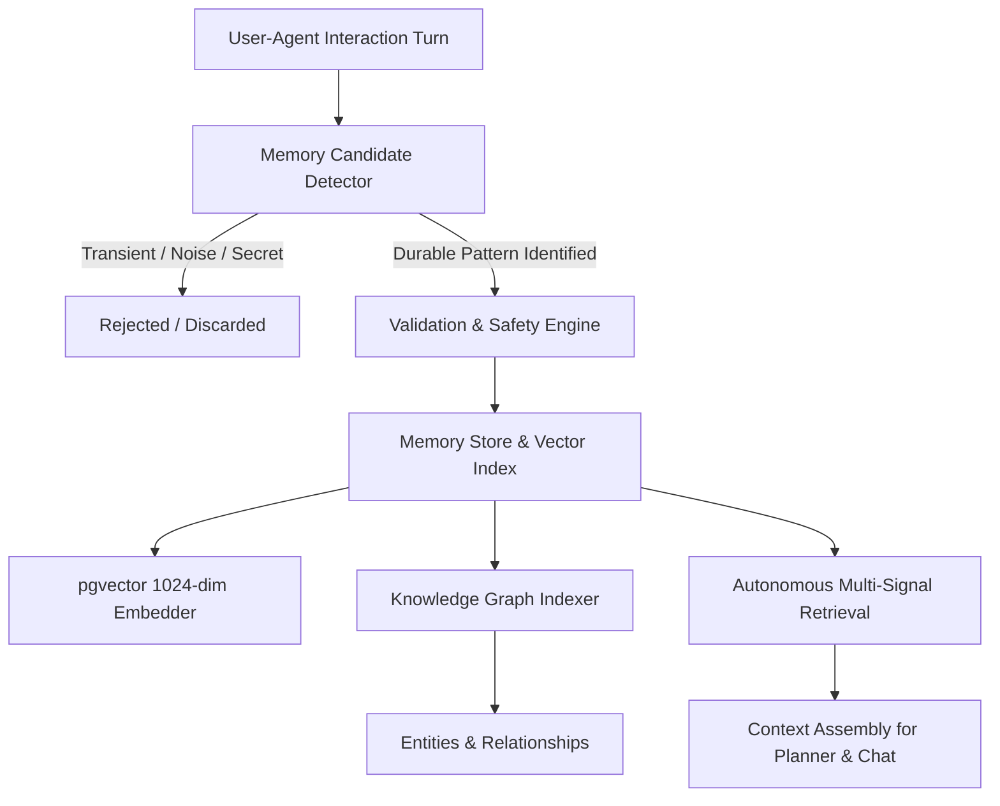

0# Kora Long-Term Memory UX & Automatic Learning (V2)

## 1. Overview & Core Philosophy

In Kora, long-term memory is **not** a manual note-taking database. Instead, Kora autonomously distills, validates, indexes, and refines durable knowledge directly from user interactions, architectural decisions, and agent execution reflections.

---

## 2. Key Architecture Principles

### A. Removal of Manual Memory Workflows
- The primary "Add Memory" button workflow has been eliminated from the UI.
- Users no longer manually populate Kora's database; memory creation occurs organically during collaboration.

### B. Automatic Candidate Detection
Candidates are detected across 7 canonical domains:
1. **`USER_PREFERENCE`**: Explicit user styling, IDE themes, language choices, tool conventions.
2. **`USER_PROFILE_CONTEXT`**: Environment, operating system, hardware, roles, and timezone facts.
3. **`DECISION`**: Key technical and architectural decisions agreed with the user.
4. **`PROJECT_CONTEXT`**: Project structure, repository conventions, runtime ports.
5. **`WORKFLOW_PATTERN`**: Testing flow (e.g., `pytest`, `flutter test`), conventional commit rules.
6. **`AGENT_LEARNING`**: Confirmed bug fixes, tool nuances, and confirmed user corrections.
7. **`TASK_CONTEXT`**: Multi-step state and milestones.

### C. Transient Chat & Noise Filtering
Kora strictly rejects temporary chatter (greetings, one-off arithmetic, ephemeral status, generic navigation) from entering long-term memory.

### D. Strict Privacy & Secret Protection
All candidate strings are audited for sensitive secrets (API keys, GitHub tokens, RSA private keys, passwords, bearer tokens). Any detected secret triggers an immediate rejection with a safety audit event.

### E. Conflict Resolution & Superseding
When new information contradicts an existing active memory (e.g. switching from dark theme to light theme):
- The `MemoryConflictResolver` identifies the contradiction.
- The older record is marked as `SUPERSEDED` while preserving historical provenance.
- The new record becomes active, preventing conflicting duplicates.

### F. Knowledge Graph Synergy
Every persistent memory extracts entity nodes (`User`, `Kora`, technologies, concepts) and links them via semantic edges (`prefers`, `uses`, `decided`, `affects`) directly into the `KnowledgeGraphService`.

---

## 3. User Experience & User Control

The redesigned **MEMORY & KNOWLEDGE** screen provides full transparency and user agency:

- **Telemetry & Stats**: Live counts of active memories, graph entities, semantic relations, and average confidence.
- **Categorized Sections**: Filterable tabs for *Learned Preferences*, *Important Facts*, *Decisions*, *Project Context*, *Workflow Patterns*, and *Entities & Graph*.
- **Review & Search**: Full-text searching across all memories.
- **User Correction**: Ability to correct or refine what Kora learned, adjusting confidence and category.
- **Enable / Disable**: Toggle memories between `ACTIVE` and `ARCHIVED`.
- **User Forget**: Permanently delete a memory record from vector store and knowledge graph reasoning.
- **Clean Empty State**: When no memories exist, renders:
  > *"Kora hasn't learned anything important yet."*
