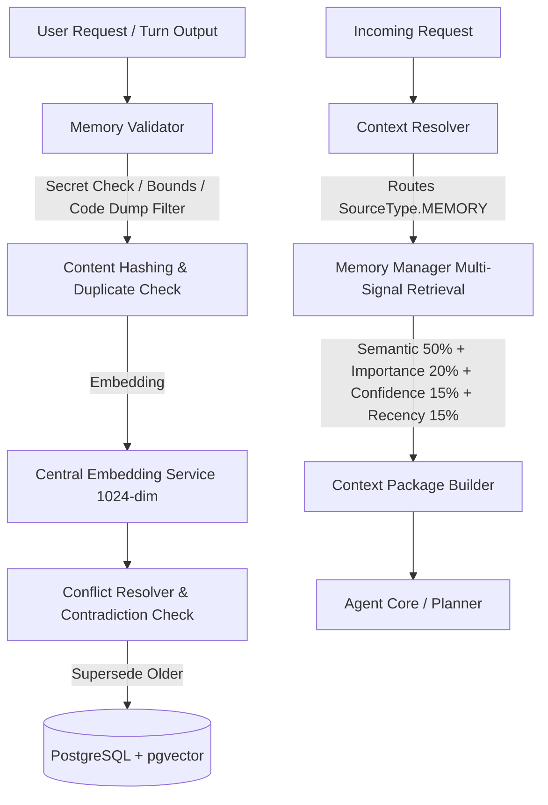

# KORA — RAG V5: LONG-TERM MEMORY SYSTEM SPECIFICATION

**Status**: Implemented & Verified  
**Version**: 1.0  
**Layer**: Memory Core (RAG V5)

---

## 1. Overview & Architecture

Kora's Long-Term Memory Layer enables the agent to continuously retain, validate, retrieve, decay, and supersede persistent personal, project, task, and learning context across sessions.

---

## 2. Memory Types

The system classifies memories into 7 distinct types:

| Type Enum | Description | Typical Retention / Decay |
| :--- | :--- | :--- |
| `USER_PREFERENCE` | Formatting styles (e.g. 2 spaces), themes, preferred tooling, tone. | Long-term / Stable |
| `USER_PROFILE_CONTEXT` | Role, tech stack proficiency, hardware, timezone, background. | Long-term / Stable |
| `PROJECT_CONTEXT` | Architecture conventions, repo rules, framework configurations. | Project-scoped |
| `TASK_CONTEXT` | Milestones, ongoing multi-step progress, active sprint objectives. | Medium / Ephemeral |
| `AGENT_LEARNING` | Operational lessons, bug resolution patterns, discovered quirks. | Long-term |
| `DECISION` | Technical consensus or architectural decisions agreed with the user. | Long-term |
| `WORKFLOW_PATTERN` | Preferred git branch naming, test commands, deployment procedures. | Long-term |

---

## 3. Memory Record Schema

Stored in table `agent_memory` in PostgreSQL:

| Field | Type | Description |
| :--- | :--- | :--- |
| `id` | `UUID` | Primary Key. |
| `type` | `TEXT` | `user_preference`, `decision`, `workflow_pattern`, etc. |
| `content` | `TEXT` | Sanitized natural language memory statement. |
| `source` | `TEXT` | `user_explicit`, `agent_turn`, `tool_output`, `inferred`, `system`. |
| `confidence` | `FLOAT` | System certainty (0.0 to 1.0). |
| `importance` | `FLOAT` | Retention and retrieval weight (0.0 to 1.0). |
| `project_id` | `UUID \| NULL` | Project UUID for isolation, or `NULL` for global user memory. |
| `content_hash` | `TEXT` | SHA-256 hash of normalized content for duplicate detection. |
| `status` | `TEXT` | `active`, `archived`, `expired`, `superseded`. |
| `embedding` | `vector(1024)` | Vector embedding (BAAI/bge-m3). |
| `created_at` | `TIMESTAMPTZ` | Timestamp when first recorded. |
| `updated_at` | `TIMESTAMPTZ` | Timestamp when last modified or superseded. |
| `last_accessed_at`| `TIMESTAMPTZ` | Timestamp when last retrieved (drives recency decay). |
| `expiration_at` | `TIMESTAMPTZ` | Optional expiration date (TTL). |
| `metadata` | `JSONB` | Provenance links (`superseded_by`, `supersedes_id`, session IDs). |

---

## 4. Lifecycle & Conflict Resolution

### A. Lifecycle State Machine
1. **Candidate**: Sanitized by `validate_candidate_memory()`. Rejects secrets, passwords, tokens, oversized code dumps, or text under 5 characters.
2. **Duplicate Check**: Normalized SHA-256 hash prevents duplicate insertion.
3. **Contradiction Detection**: Semantic similarity $\ge 0.82$ on matching memory type and project scope triggers contradiction resolution.
4. **Superseding**: Older contradictory memory is marked `SUPERSEDED`, and bi-directional provenance references (`superseded_by`, `supersedes_id`) are attached.
5. **Decay / Expiration**: Memories with elapsed `expiration_at` are marked `EXPIRED`. Inactive memories undergo exponential recency decay.
6. **Archival**: Explicit archival via `archive_memory(memory_id)`.

### B. Multi-Signal Retrieval Scoring Formula
When a query is routed to Memory, candidates are scored using:

$$\text{Final Score} = 0.50 \cdot \text{SemanticSimilarity} + 0.20 \cdot \text{Importance} + 0.15 \cdot \text{Confidence} + 0.15 \cdot \text{RecencyScore}$$

Where the recency decay factor is computed with a 30-day half-life:

$$\text{RecencyScore} = \exp\left(-\frac{\ln(2) \cdot \Delta t_{\text{days}}}{30.0}\right)$$

---

## 5. Public APIs

### `MemoryManager` (`memory.manager`)
- `create_memory(content, type, project_id, confidence, importance, source, expiration_at, metadata)` $\rightarrow$ `MemoryRecord`
- `retrieve_memories(query, project_id, memory_types, top_k, min_confidence, include_global, min_score)` $\rightarrow$ `list[MemoryRetrievalResult]`
- `search_memories(query, project_id, top_k)` $\rightarrow$ `list[MemoryRecord]`
- `update_memory(memory_id, content, importance, confidence, status, metadata)` $\rightarrow$ `MemoryRecord`
- `archive_memory(memory_id)` $\rightarrow$ `bool`
- `delete_memory(memory_id)` $\rightarrow$ `bool`
- `get_memory(memory_id)` $\rightarrow$ `MemoryRecord | None`
- `get_memory_status(project_id)` $\rightarrow$ `MemoryStats`
