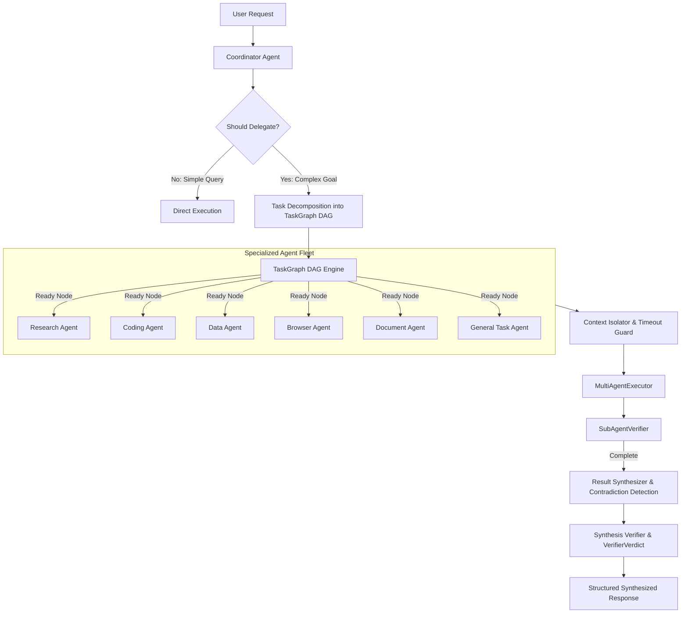

# Kora Multi-Agent Orchestration Architecture (V16)

## 1. Overview & Purpose

The **Multi-Agent Orchestration Subsystem (V16)** allows Kora to decompose complex, multi-domain, or highly parallelizable user goals into specialized sub-tasks, execute them across autonomous sub-agents with strict context isolation, synthesize the collected results, and verify the final response before delivering it to the user.

---

## 2. Architecture & Execution Flow

---

## 3. Specialized Agent Registry (`apps/agent/orchestration/registry.py`)

Kora registers 6 domain-specialized sub-agent types:

| Agent Profile | Key Capabilities | Permitted Tools | Permitted Models | Permission Level |
| :--- | :--- | :--- | :--- | :--- |
| **Research Agent** | Web search, evidence extraction, fact-checking | `duckduckgo_search`, `fetch_page`, `extract_evidence` | `qwen-chat`, `qwen-reason` | `normal` |
| **Coding Agent** | Code generation, AST analysis, syntax checking, Git | `file_read`, `file_write`, `create_file`, `run_terminal_command`, `git_status`, `git_diff` | `qwen-code`, `qwen-reason` | `sensitive` |
| **Data Agent** | CSV processing, SQL querying, JSON transformations | `read_file`, `parse_csv`, `query_database` | `qwen-code`, `qwen-reason`, `qwen-chat` | `normal` |
| **Browser Agent** | Web navigation, form-filling, visual inspection | `browser_navigate`, `browser_click`, `browser_type`, `browser_screenshot` | `gemma-vision`, `qwen-chat` | `sensitive` |
| **Document Agent** | PDF extraction, document chunking, RAG search | `rag_retrieve`, `read_file`, `parse_pdf`, `parse_docx` | `qwen-chat`, `qwen-reason` | `normal` |
| **General Task Agent** | General reasoning, step execution, formatting | `file_read`, `system_info`, `calculator` | `qwen-chat` | `normal` |

---

## 4. Task Graph DAG Engine (`apps/agent/orchestration/graph.py`)

The `TaskGraph` manages execution dependencies as a Directed Acyclic Graph (DAG):
- **Sequential Flows**: $A \to B \to C$ (Downstream nodes receive upstream outputs).
- **Parallel Fan-out / Fan-in**: $A, B \to C$ (Parallel independent execution, merged at node $C$).
- **Topological Ready-Node Resolution**: Node status progresses `PENDING` $\to$ `READY` $\to$ `RUNNING` $\to$ `COMPLETED`.
- **Cascading Cancellation**: If an upstream node fails or times out, all downstream dependent nodes are automatically marked `CANCELLED`.
- **Acyclicity Validation**: Kahn's algorithm validates that no circular dependencies exist.

---

## 5. Context Isolation & Security (`apps/agent/orchestration/context.py`)

- Sub-agents receive **only the scoped subset** of context required for their specific objective.
- For example, the `ResearchAgent` receives search hints and queries without exposing local filesystem secrets or source code; the `CodingAgent` receives targeted file snippets without global user chat histories.
- Recursion protection: Enforces `max_delegation_depth = 2` to prevent runaway sub-agent delegation.

---

## 6. Result Synthesis & Contradiction Detection (`apps/agent/orchestration/synthesis.py`)

- Aggregates sub-agent outputs into a coherent markdown document.
- **Contradiction Detection**: Identifies conflicting factual assertions across completed nodes (e.g. opposing enablement or existence claims) and flags them in a `ContradictionReport`.
- Preserves **source provenance** for every sub-agent contribution.

---

## 7. Storage & Migrations (`infra/migrations/005_multiagent_schema.sql`)

- `agent_coordination_runs`: Logs top-level multi-agent coordination executions, status, and synthesis payloads.
- `subagent_task_records`: Records individual sub-agent task objectives, dependencies, execution inputs, outputs, and durations.
