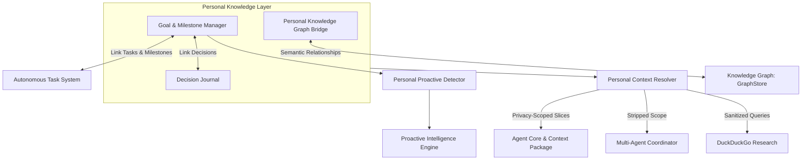

# Kora Personal Knowledge & Goal Intelligence (V17)

## 1. Overview & Purpose

The **Personal Knowledge & Goal Intelligence Layer (V17)** connects Kora's existing RAG, Long-Term Memory, Knowledge Graph, Autonomous Tasks, Projects, and Decisions into a unified personal context layer.

Instead of treating user tasks as isolated executions, Kora understands:
- What high-level **goals** the user is pursuing
- What **milestones** and **tasks** contribute to each goal
- What **decisions** have been made, along with trade-offs and alternatives
- The **exact, fact-based progress** of each goal without fabricated values
- When deadlines are approaching or goals have stalled

---

## 2. Core Architecture

---

## 3. Key Components & Implementation

### A. Goal & Milestone Manager (`apps/agent/personal/manager.py`)
- **Lifecycle States**: `ACTIVE`, `PAUSED`, `COMPLETED`, `CANCELLED`, `ARCHIVED`.
- **Milestone Tracking**: Ordered milestones with individual deadlines and completion flags.
- **Fact-Based Progress Calculation**:
  $$\text{Progress} = \frac{\text{Completed Milestones} + \text{Completed Linked Tasks}}{\text{Total Milestones} + \text{Total Linked Tasks}}$$
  Progress is mathematically derived from real execution state.
- **Deletion Safety Guard**: `delete_goal` strictly requires `confirm=True` to prevent accidental loss.

### B. Decision Journal (`apps/agent/personal/journal.py`)
- Captures explicit user and architectural decisions:
  - Decision text and context
  - Alternatives considered
  - Trade-off reasoning and evidence
  - Related project and goal links
  - Retrospective outcomes (e.g. latency improvements, stability feedback)
- *Strict Rule*: Model reasoning is never automatically recorded as user decisions without explicit user confirmation.

### C. Personal Knowledge Graph Bridge (`apps/agent/personal/graph_bridge.py`)
- Extends the `GraphStore` with user-level relationships:
  - `Project` $\xrightarrow{\text{RELATED\_TO (supports)}}$ `Goal`
  - `Task` $\xrightarrow{\text{RELATED\_TO (contributes\_to)}}$ `Goal`
  - `Decision` $\xrightarrow{\text{RELATED\_TO (affects)}}$ `Project / Goal`
  - `Person` $\xrightarrow{\text{RELATED\_TO (prefers)}}$ `Concept / Technology`

### D. Personal Context Resolution & Privacy Boundaries (`apps/agent/personal/context_resolver.py`)
- **Token Budgeting**: Selects relevant active goals and decisions into a bounded `PersonalContextPackage`.
- **Privacy Scoping for Sub-Agents**: Sub-agents receive only high-level goal titles and target milestones; private decision journals and unrelated notes are stripped.
- **Sanitization for External Web Research**: Strips local filesystem paths, emails, and sensitive identifiers before querying DuckDuckGo.

### E. Proactive Deadline & Stalled Goal Detection (`apps/agent/personal/proactive_hooks.py`)
- Monitors active goals:
  - Emits proactive alerts when target dates are within 3 days (`HIGH` urgency).
  - Emits suggestions when goals have stalled with zero progress updates for over 7 days.

---

## 4. Storage & Schema Migrations (`infra/migrations/006_personal_knowledge_schema.sql`)

- `personal_goals`: Tracks goal definitions, priority, target dates, progress, linked task IDs, and linked decision IDs.
- `personal_milestones`: Stores milestone items tied to parent goals with completion timestamps.
- `personal_decisions`: Stores decision journal records with alternatives, reasoning, and outcomes.
