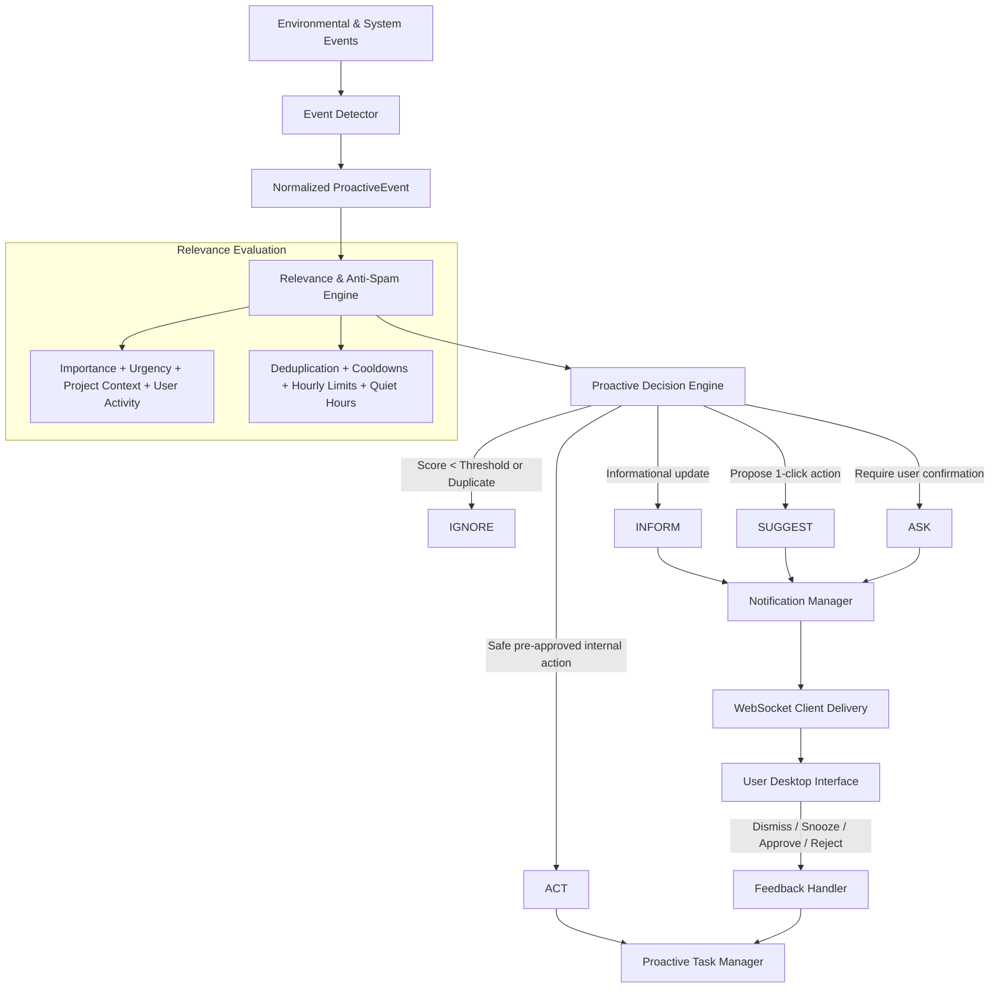

# Kora Proactive Intelligence Engine (V15)

## 1. Overview & Purpose

The **Proactive Intelligence Engine** enables Kora to identify useful opportunities to assist the user autonomously without causing disruption, noise, or continuous interruptions.

Instead of waiting passively for user prompts or spamming the user on every small event, Kora observes environmental and internal triggers, scores their relevance and urgency against active project context and recent user interactions, checks anti-spam filters, and decides the optimal tier of action (`IGNORE`, `INFORM`, `SUGGEST`, `ASK`, `ACT`).

---

## 2. Core Architecture

---

## 3. Event Sources (`apps/agent/proactive/detector.py`)

The `EventDetector` captures and standardizes events from multiple subsystems into typed `ProactiveEvent` objects with deterministic SHA-256 content hashes:

1. **Scheduled & Autonomous Tasks (`TASK_LIFECYCLE`, `SCHEDULED_TASK`)**:
   - `on_task_completed`: Duration, summary, output metadata.
   - `on_task_failed`: Goal, error message, replan count.
   - `on_task_overdue`: Scheduled timestamp vs current time.
2. **Project & Workspace (`PROJECT_FILE_CHANGE`)**:
   - Significant file additions, modifications, and deletions.
3. **Long-Term Memory & Learning (`MEMORY_CHANGE`)**:
   - Contradiction resolution between new observations and prior facts.
   - User preference updates.
4. **System Diagnostics & Observability (`SYSTEM_EVENT`)**:
   - Component health degradation and elevated error rates.
5. **Automation & Scheduled Cron (`AUTOMATION`)**:
   - Rule triggers and automation action status.
6. **Configurable External Checks (`EXTERNAL_CHECK`)**:
   - Git repository status, remote API health, dependency audit updates.

---

## 4. Multi-Factor Relevance & Anti-Spam (`apps/agent/proactive/relevance.py`)

### A. Multi-Factor Scoring Formula
$$\text{Relevance} = (0.40 \times \text{Importance}) + (0.35 \times \text{Urgency}) + (0.15 \times \text{ProjectScope}) + (0.10 \times \text{RecentActivity})$$

- **Urgency Multipliers**: `CRITICAL` (1.0), `HIGH` (0.8), `NORMAL` (0.5), `LOW` (0.2).
- **Project Scope**: Active project match = 1.0; unassociated project = 0.3.
- **Recent Activity**: Recent user interaction on scope = 1.0; idle = 0.4.

### B. Anti-Spam Protections
- **Exact Hash Deduplication & Exponential Backoff**: Identical events within backoff windows ($t_{\text{cooldown}} \times 2^n$) are automatically suppressed.
- **Per-Category Cooldowns**: Enforces minimum wait times per category (`TASK`: 2m, `PROJECT`: 5m, `SYSTEM`: 10m, `SECURITY`: 30s) unless priority is `URGENT`/`CRITICAL`.
- **Hourly Rate Limiter**: Maximum 12 notifications per hour (configurable via `max_notifications_per_hour`).
- **Quiet Hours / Do Not Disturb**: Suppresses non-urgent notifications during configured quiet periods (e.g. 22:00 to 07:00 UTC).

---

## 5. Proactive Decision Engine (`apps/agent/proactive/decision.py`)

| Decision | Criteria | Typical Action |
| :--- | :--- | :--- |
| `IGNORE` | Score < threshold, duplicate hash, cooldown active, or quiet hours. | Dropped silently. |
| `INFORM` | Salient update, no action required (e.g., task finished, memory updated). | Delivered to client as non-intrusive notification. |
| `SUGGEST` | Recommended action with low/moderate impact (e.g., re-index workspace, diagnostic inspect). | Delivered with 1-click execution button. |
| `ASK` | High-impact action or task failure retry requiring user confirmation. | Delivered with explicit Approve / Reject options. |
| `ACT` | Safe, read-only internal action AND `allow_autonomous_actions = True`. | Executed immediately; notification marked `EXECUTED`. |

### Safety Invariants
1. **Zero Permission Bypass**: All tool executions strictly route through `PermissionGate`.
2. **Autonomous Degradation**: If `allow_autonomous_actions` is false, `ACT` automatically degrades to `SUGGEST` or `ASK`.
3. **No Destructive Autonomous Actions**: Deleting files, modifying remote repos, or executing shell commands are never classified as `ACT`.
4. **Secret Sanitization**: All notifications pass through regex sanitizers masking API keys (`sk-...`, `ghp_...`, `hf_...`).

---

## 6. Proactive Tasks & Anti-Recursion (`apps/agent/proactive/tasks.py`)

When creating autonomous follow-up tasks (e.g. retrying a failed task or scheduling a workspace re-index):
- Each proactive task tracks `proactive_depth` in its metadata.
- If `current_depth > max_proactive_depth` (default = 2), task creation is **strictly rejected**.
- Duplicate active tasks with identical goals are rejected by `TaskManager`.

---

## 7. Storage & Migrations (`infra/migrations/004_proactive_schema.sql`)

- `proactive_events`: Logs detected events with source, title, payload, hash, relevance score, and decision.
- `proactive_notifications`: Tracks notification lifecycle (`PENDING`, `DELIVERED`, `DISMISSED`, `SNOOZED`, `APPROVED`, `REJECTED`, `EXECUTED`).
